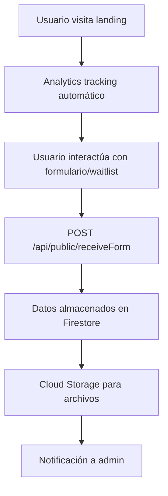
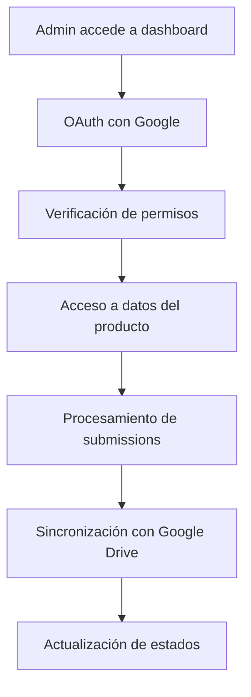
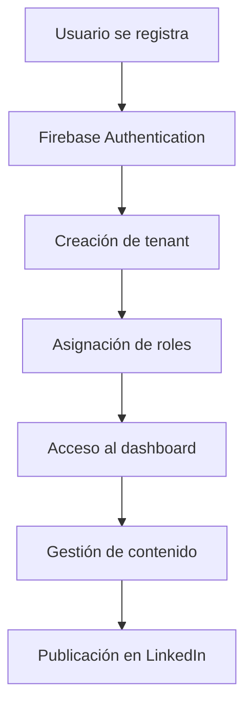

# Falcon Core V2 - Flujo General y Dependencias

## Resumen Ejecutivo

Falcon Core V2 es una plataforma multi-producto que integra 7 frontends diferentes con un backend unificado basado en Firebase Functions. El sistema maneja autenticación, analytics, gestión de datos y administración centralizada.

## Arquitectura de Flujo General

### 1. Flujo de Usuario Público



### 2. Flujo de Administración



### 3. Flujo de Ahau (Multi-tenant)



## Dependencias del Sistema

### Backend Dependencies

#### Core Dependencies
- **firebase-functions**: ^6.4.0 - Runtime de Firebase Functions
- **firebase-admin**: ^12.0.0 - SDK administrativo de Firebase
- **express**: ^4.18.2 - Framework web para APIs
- **cors**: ^2.8.5 - Middleware para CORS

#### Authentication & Security
- **@google-cloud/secret-manager**: ^6.1.0 - Gestión de secretos
- **googleapis**: ^133.0.0 - APIs de Google (OAuth, Drive)

#### Utilities
- **axios**: ^1.10.0 - Cliente HTTP
- **date-fns**: ^4.1.0 - Manipulación de fechas
- **dotenv**: ^17.2.0 - Variables de entorno
- **undici**: ^6.21.3 - Cliente HTTP alternativo

### Frontend Dependencies (Compartidas)

#### Core Framework
- **next**: 14.2.30 - Framework React
- **react**: ^18 - Biblioteca de UI
- **react-dom**: ^18 - Renderizado DOM

#### Firebase Integration
- **firebase**: ^12.1.0 - SDK cliente de Firebase
- **firebase-admin**: ^13.4.0 - SDK administrativo (frontend)

#### UI & Animations
- **framer-motion**: ^11.0.0 - Animaciones
- **lucide-react**: ^0.400.0 - Iconos
- **tailwindcss**: ^3.3.0 - Framework CSS

#### HTTP & Utilities
- **axios**: ^1.6.0 - Cliente HTTP

## Flujos de Datos Detallados

### 1. Analytics Flow

```typescript
// Frontend (Todos los productos)
AnalyticsTracker.trackPageVisit() 
  → POST /api/public/trackVisit
  → Firestore: analytics collection
  → Admin Dashboard: Métricas en tiempo real
```

**Datos capturados:**
- Page visits, exits, CTA clicks
- User agent, screen resolution
- Referrer, session ID
- Time on page

### 2. Form Submission Flow

```typescript
// Frontend
Form submission
  → POST /api/public/receiveForm
  → Validation & sanitization
  → Firestore: submissions collection
  → Cloud Storage: file uploads
  → Admin notification
```

**Productos que usan este flujo:**
- OnboardingAudit
- Ignium (waitlist)
- JobPulse
- PulzioHQ

### 3. OAuth Flow

```typescript
// Admin Login
GET /oauth/login?project_id=X
  → Google OAuth consent
  → GET /oauth/callback?code=Y
  → Token exchange
  → ENCRYPTION_KEY validation
  → Google Drive folder creation
  → Admin session creation
  → Dashboard redirect
```

### 4. Ahau Multi-tenant Flow

```typescript
// User Registration
Firebase Auth signup
  → POST /api/ahau/tenants.create
  → Firestore: tenants collection
  → User role assignment
  → Dashboard access

// Content Management
POST /api/ahau/drafts.create
  → Firestore: tenants/{id}/drafts
  → AI content generation
  → LinkedIn publishing
  → Analytics tracking
```

## Integraciones Externas

### Google Services
- **Google Drive**: Almacenamiento de archivos procesados
- **Google OAuth**: Autenticación de administradores
- **Google APIs**: Integración con LinkedIn (via Google)

### Firebase Services
- **Firestore**: Base de datos principal
- **Firebase Auth**: Autenticación de usuarios (Ahau)
- **Firebase Hosting**: Hosting de frontends
- **Firebase Functions**: Backend serverless

### LinkedIn Integration (Ahau)
- **LinkedIn API**: Publicación de contenido
- **OAuth Flow**: Autenticación con LinkedIn
- **Metrics API**: Obtención de estadísticas

## Configuración de Deployment

### Firebase Configuration
```json
{
  "hosting": {
    "target": "uaylabs",
    "public": "frontends/uaylabs/out",
    "rewrites": [
      { "source": "/ahau/**", "destination": "/ahau/index.html" },
      { "source": "/onboardingaudit/**", "destination": "/onboardingaudit/index.html" }
    ]
  },
  "functions": {
    "runtime": "nodejs20",
    "secrets": ["cloud-storage-key", "ENCRYPTION_KEY"]
  }
}
```

### Environment Variables
- **ENCRYPTION_KEY**: Clave de encriptación AES-256-GCM
- **cloud-storage-key**: Credenciales de Google Cloud Storage
- **GOOGLE_CLIENT_ID**: OAuth client ID
- **GOOGLE_CLIENT_SECRET**: OAuth client secret

## Monitoreo y Analytics

### Métricas del Sistema
- **Visitas por producto**: Tiempo real
- **Conversiones**: Formularios completados
- **Waitlist registrations**: Por producto
- **Admin activity**: OAuth logins, procesamiento

### Health Checks
- **Backend**: `GET /health` - Estado de la API
- **Ahau**: `GET /api/ahau/health` - Estado específico
- **Database**: Firestore connection status

## Escalabilidad

### Horizontal Scaling
- **Firebase Functions**: Auto-scaling automático
- **Firestore**: Escalado automático de base de datos
- **CDN**: Firebase Hosting con CDN global

### Vertical Scaling
- **Memory**: 256Mi por función (configurable)
- **Timeout**: 60s por función (configurable)
- **Concurrency**: 100 requests simultáneos

## Seguridad

### Data Protection
- **Encryption at rest**: Firestore encryption
- **Encryption in transit**: HTTPS/TLS
- **OAuth tokens**: AES-256-GCM encryption
- **API keys**: Google Secret Manager

### Access Control
- **Public endpoints**: Sin autenticación
- **Admin endpoints**: OAuth requerido
- **Ahau endpoints**: Firebase Auth + tenant verification
- **Rate limiting**: Implementado en funciones

## Troubleshooting

### Common Issues
1. **OAuth redirects**: Verificar ENCRYPTION_KEY
2. **Analytics not tracking**: Verificar CORS y network
3. **Firestore permissions**: Verificar reglas de seguridad
4. **Build failures**: Verificar dependencias compartidas

### Debug Endpoints
- `GET /ping` - Health check básico
- `GET /health` - Estado detallado del sistema
- Logs disponibles en Firebase Console
